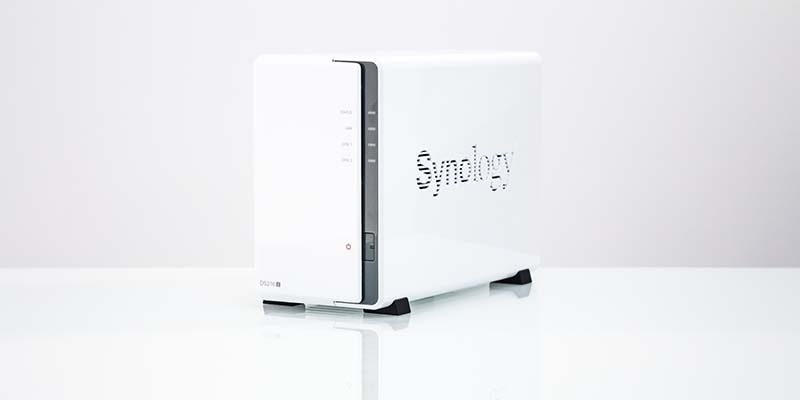
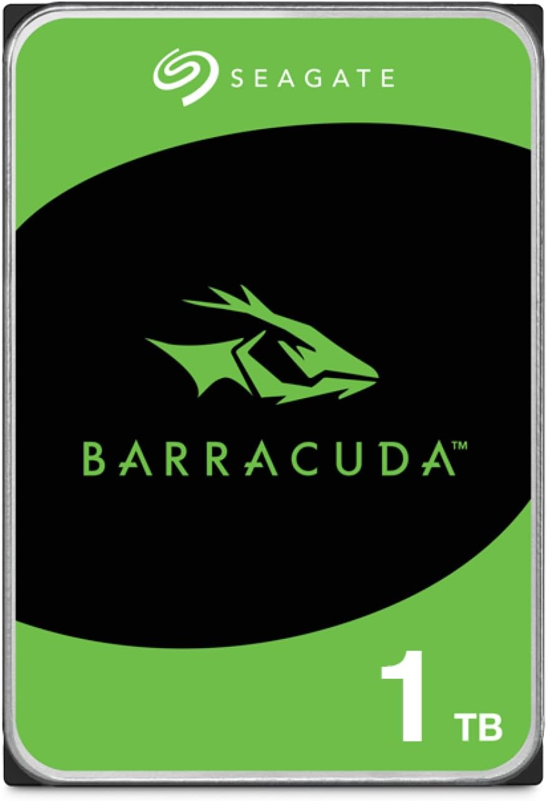

# Montaje de un NAS en entorno doméstico

## Introducción

Un NAS (Network Attached Storage) es un dispositivo de almacenamiento conectado a la red que permite guardar archivos y acceder a ellos desde distintos dispositivos como ordenadores, móviles o tablets. En este proyecto no solo se plantea su montaje como práctica, sino como una solución real pensada para mi casa.

La idea principal es disponer de un sistema donde poder almacenar archivos personales, especialmente fotos y vídeos, que suelen ocupar bastante espacio. Además, también busco tener una copia de seguridad de estos datos, evitando depender de servicios en la nube y teniendo un mayor control sobre la información.

---

## Elección del hardware y presupuesto

Para montar el NAS he buscado una opción que sea económica pero que al mismo tiempo cumpla con lo que necesito a nivel personal.

He elegido un NAS Synology DS223j, que es un modelo de dos bahías orientado a uso doméstico. Su precio ronda los 214,90 € en Amazon y ofrece lo necesario para gestionar almacenamiento en red sin complicaciones. No he optado por modelos más avanzados porque no necesito un alto rendimiento, sino un sistema fiable para guardar archivos y acceder a ellos.

En cuanto al almacenamiento, he decidido utilizar dos discos duros Seagate Barracuda de 1 TB cada uno, con un precio aproximado de 99,99 € por unidad. Esta capacidad es suficiente para empezar y cubrir el uso que le voy a dar, sobre todo teniendo en cuenta que los vídeos y las fotos pueden ocupar bastante espacio.

El coste total del sistema se sitúa alrededor de los 414 €, lo cual considero razonable teniendo en cuenta que es una solución propia, sin costes mensuales y con posibilidad de ampliación en el futuro.

---

## 3.1 NAS seleccionado

### Synology DS223j

Modelo elegido:  
Synology DS223j NAS de escritorio de 2 bahías  

Precio aproximado: 214,90 €  
Enlace: https://amzn.eu/d/03WKHmZK

  

---

## 3.2 Discos duros seleccionados

Modelo elegido:  
Seagate Barracuda 1TB (ST1000DMZ14)

Precio aproximado: 99,99 € (cada uno)  
Enlace: https://amzn.eu/d/03RrMA1Q

Se utilizarán 2 discos duros.

### Configuración

- 2 discos duros de 1 TB  
- Configuración RAID 1  

  

---

## 3.3 Coste total estimado

| Componente | Modelo | Precio aproximado |
|-----------|--------|------------------|
| NAS | Synology DS223j | 214,90 € |
| Disco duro x2 | Seagate Barracuda 1TB | 199,98 € |
| **Total estimado** | — | **414,88 €** |

---

## Configuración del almacenamiento

Uno de los aspectos más importantes en este proyecto es la configuración del RAID. En este caso he utilizado RAID 1, que consiste en duplicar los datos en ambos discos duros.

Esto significa que toda la información se guarda en los dos discos al mismo tiempo. De esta forma, si uno de ellos falla, los datos siguen estando disponibles en el otro. Para el uso que le voy a dar, esto es clave, ya que voy a almacenar archivos personales importantes como fotos y vídeos.

---

## Instalación del sistema

El proceso de montaje comienza con la instalación de los discos duros dentro del NAS, asegurándose de que queden bien colocados en sus bandejas.

  

Una vez instalados, se conecta el NAS a la corriente eléctrica y al router mediante un cable de red. Al encenderlo, el dispositivo obtiene una dirección IP dentro de la red local, que permite acceder a su configuración desde el navegador.

  

---

## Configuración inicial

Después de acceder al sistema, el siguiente paso es realizar la configuración inicial. En primer lugar, se crea el usuario administrador, que será el encargado de gestionar el NAS.

  

A continuación, se configura el almacenamiento en RAID 1, lo que permite garantizar la seguridad de los datos.

  

---

## Gestión de usuarios

Una vez el sistema está configurado, se pueden crear los distintos usuarios que van a utilizar el NAS. Esto permite que cada persona tenga su propio acceso.

  

También es posible asignar permisos a cada usuario, controlando qué carpetas pueden ver o modificar. Esto es útil para organizar la información y mantener cierto nivel de seguridad.

  

---

## Pruebas de funcionamiento

Para comprobar que todo funciona correctamente, se ha accedido al NAS desde distintos dispositivos conectados a la misma red.

  

En estas pruebas se ha verificado que el acceso es correcto, que los archivos están disponibles y que el sistema responde de forma adecuada.

---

## Conclusión

Montar un NAS en casa es una solución muy útil cuando se manejan archivos que ocupan bastante espacio, como vídeos o colecciones de fotos. Permite tener todo organizado en un único lugar y acceder a ello de forma sencilla desde distintos dispositivos.

En este caso, he buscado una configuración que sea económica pero suficiente para el uso que le voy a dar. El uso de RAID 1 aporta seguridad, y el hardware elegido cumple con las necesidades sin suponer un gasto excesivo.

Por ello, considero que esta solución es adecuada para un entorno doméstico real, combinando funcionalidad, seguridad y un coste razonable.