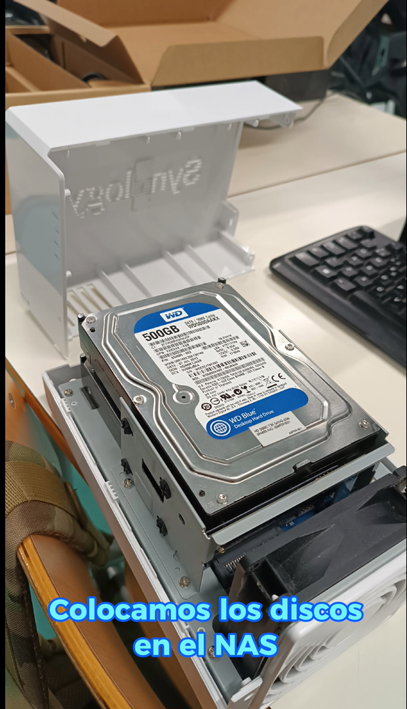
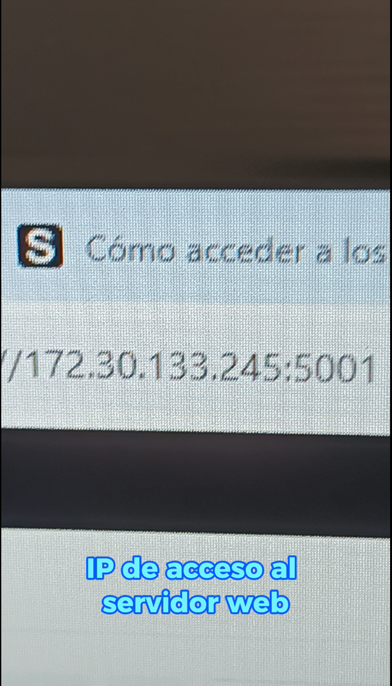
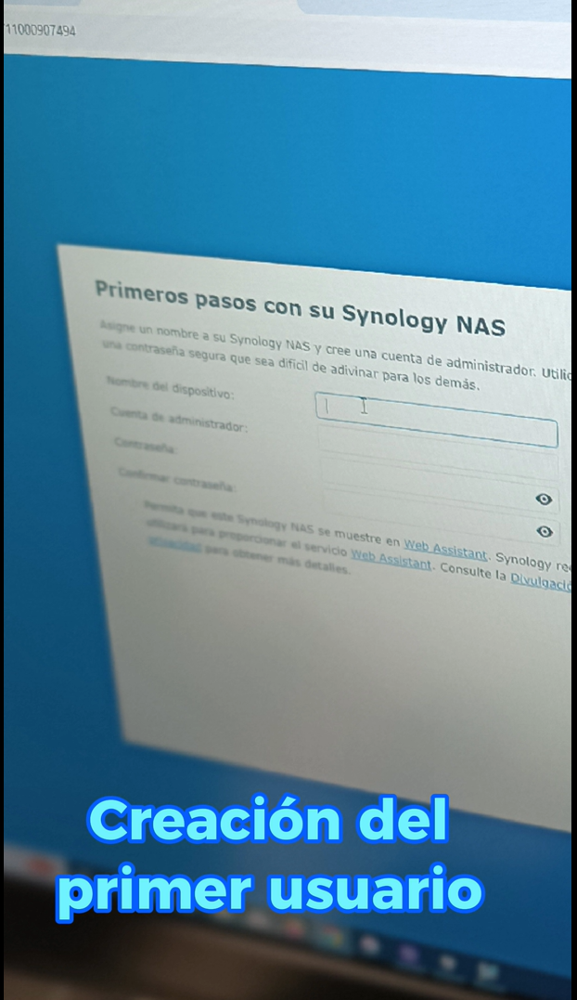
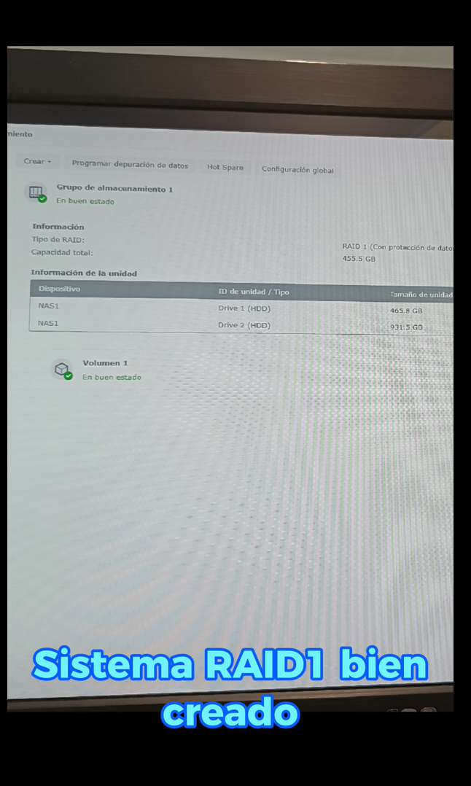
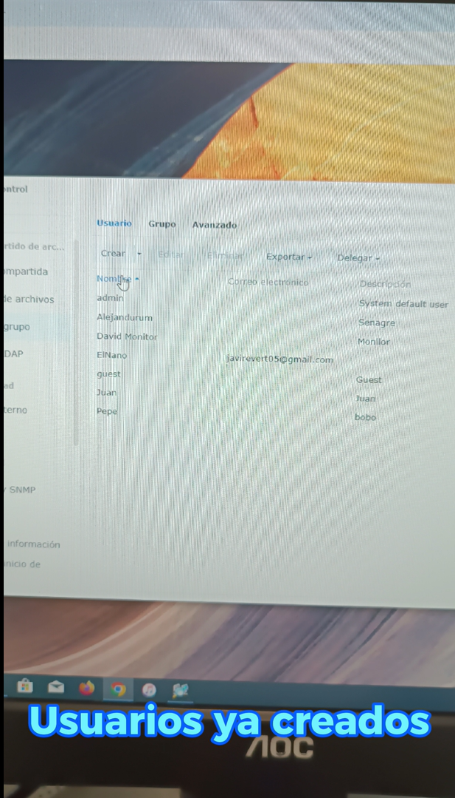
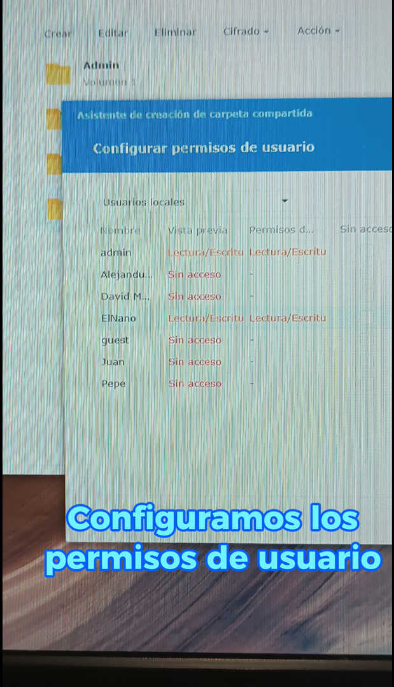
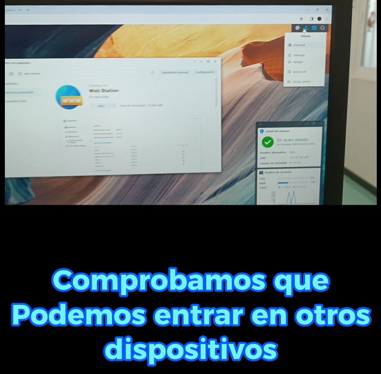

# Montaje de un NAS en entorno doméstico

## 1. Introducción

Un NAS (Network Attached Storage) es un dispositivo de almacenamiento conectado a una red que permite centralizar archivos y acceder a ellos desde distintos dispositivos.

En este proyecto se plantea el montaje de un NAS en un entorno doméstico, con el objetivo de disponer de almacenamiento propio, accesible y seguro, evitando costes elevados y servicios externos.

## 2. Objetivo del proyecto

El objetivo principal es diseñar e implementar un sistema NAS para uso personal que cumpla con los siguientes requisitos:

* Bajo coste
* Facilidad de uso
* Seguridad de los datos
* Acceso desde múltiples dispositivos

## 3. Presupuesto

| Componente     | Precio aproximado    |
| -------------- | -------------------- |
| NAS Synology   | 200€ - 300€          |
| Discos duros   | 30€ - 50€ (cada uno) |
| Cable Ethernet | 5€                   |
| Total estimado | 235€ - 355€          |

Se ha optado por una configuración económica adecuada para uso doméstico.

## 4. Material utilizado

* NAS Synology

  

* 2 discos duros
* Cable de red Ethernet
* Equipo informático para configuración

## 5. Instalación del sistema

### 5.1 Instalación de discos

Se insertan los discos duros en las bandejas del NAS asegurando su correcta fijación.

  

### 5.2 Conexión del dispositivo

El NAS se conecta a la corriente eléctrica y al router mediante cable Ethernet.

### 5.3 Acceso al sistema

Se accede al NAS desde el navegador utilizando la dirección IP asignada en la red.

  

## 6. Configuración inicial

### 6.1 Creación del usuario administrador

Se crea el primer usuario con privilegios de administración para gestionar el sistema.

  

### 6.2 Configuración del almacenamiento

Se configura el sistema en RAID 1 para garantizar la redundancia de datos.

  

#### RAID 1

El RAID 1 consiste en la duplicación de datos en dos discos, permitiendo mantener la información en caso de fallo de uno de ellos.

## 7. Gestión de usuarios

### 7.1 Creación de usuarios

Se crean los distintos usuarios que tendrán acceso al sistema.

  

### 7.2 Configuración de permisos

Se asignan permisos específicos a cada usuario en función de sus necesidades.

  

## 8. Pruebas de funcionamiento

Se verifica el acceso al NAS desde distintos dispositivos dentro de la red.

  

Se comprueba que:

* El acceso es correcto
* Los archivos son visibles
* El sistema funciona con normalidad

## 9. Conclusión

El montaje de un NAS en un entorno doméstico es una solución eficiente para la gestión de archivos personales.

Permite disponer de almacenamiento propio, seguro y accesible, con una inversión reducida en comparación con otras alternativas.

La configuración en RAID 1 aporta una capa adicional de seguridad, siendo una opción recomendable para uso personal.

## 10. Opinión personal

Considero que la implementación de un NAS en casa es una solución práctica y económica, especialmente para usuarios que necesitan gestionar grandes volúmenes de datos o mantener copias de seguridad.

La relación calidad/precio obtenida en este proyecto es adecuada para un entorno doméstico.
